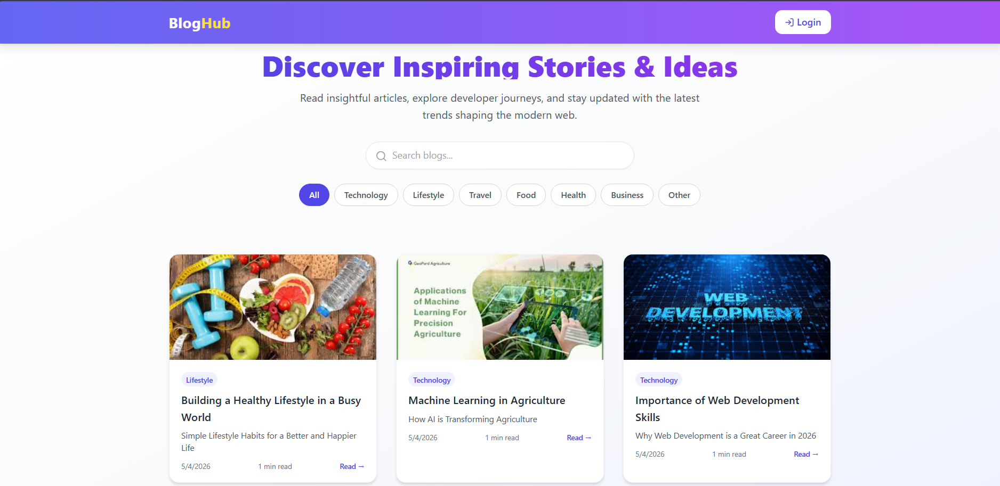
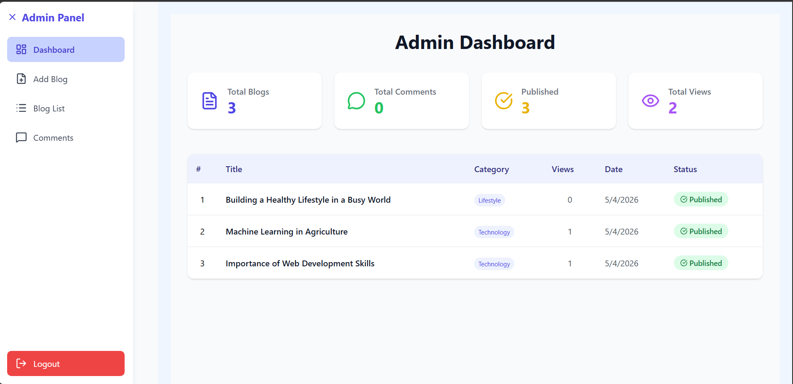
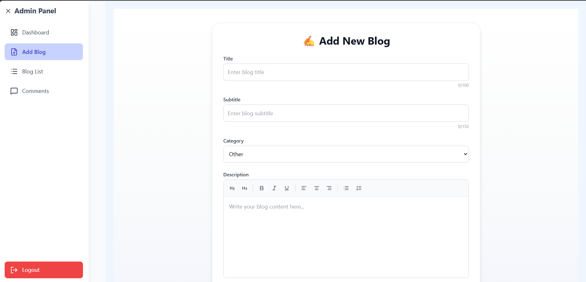
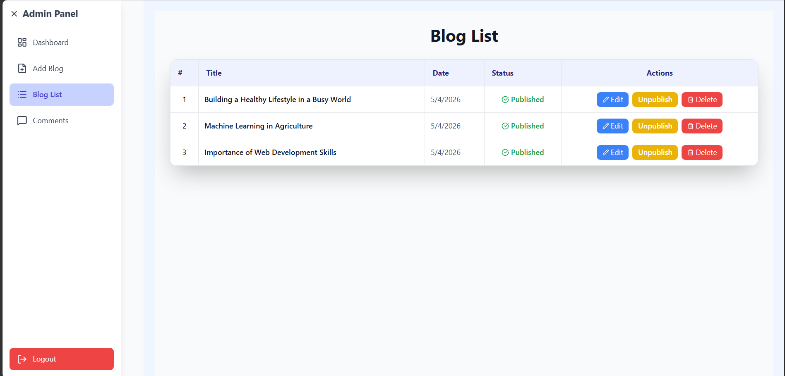
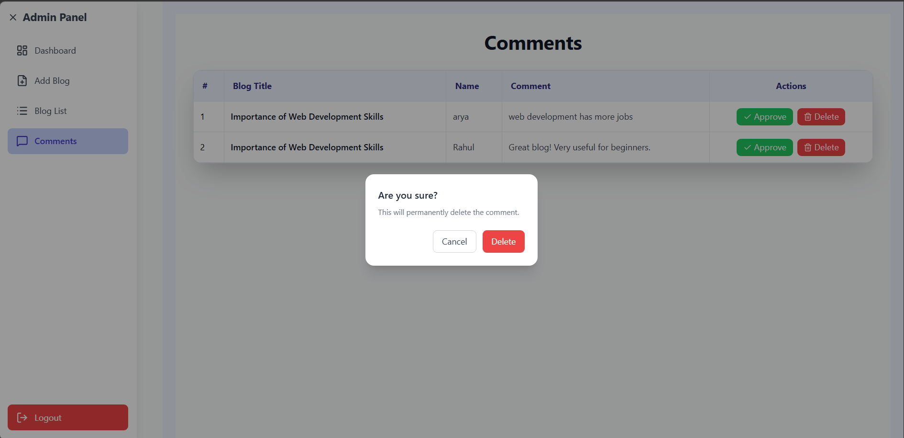
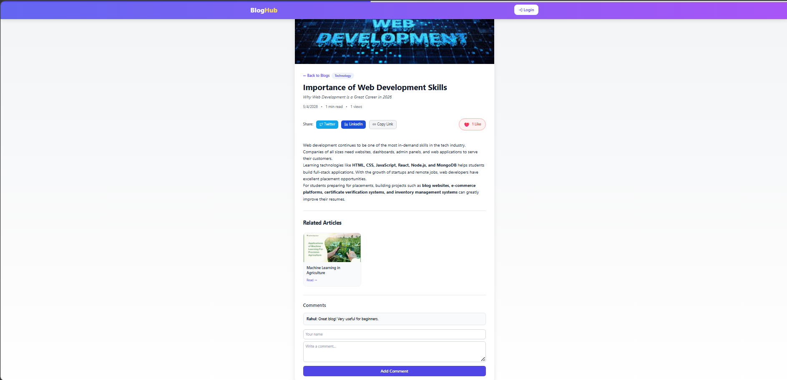

# BlogHub — Full Stack Blog Platform

A production-ready full-stack blog platform built with the MERN stack.
Features secure authentication, rich text editing, image uploads,
comment moderation, and a complete admin panel.

## 🌐 Live Demo
**Frontend:** https://your-app.vercel.app  
**Backend API:** https://your-api.onrender.com

> **Admin Login for Demo**  
> Email: Admin@gmail.com  
> Password: Admin123

---

## ✨ Features

### Public
- Browse and search published blogs
- Filter blogs by category
- Pagination with page numbers
- Reading time estimation
- View count tracking per blog
- Like and unlike blogs
- Share blogs on Twitter and LinkedIn
- Reading progress bar
- Submit comments (goes for admin approval)
- Related articles on each blog
- Responsive design on all devices

### Admin Panel
- Secure login with JWT httpOnly cookies
- Create blogs with TipTap rich text editor
- Upload blog images via Cloudinary
- Publish and unpublish blogs
- Edit existing blogs
- Delete blogs with confirmation modal
- Approve and delete comments
- Dashboard with stats (total blogs, comments, views)
- Category management per blog

### Security
- JWT stored in httpOnly cookies (XSS safe)
- Rate limiting on all API endpoints
- Brute force protection on login (5 attempts per 15 min)
- Input validation with express-validator
- Helmet security headers
- DOMPurify on frontend for XSS protection
- IP based view tracking with MongoDB TTL indexes
- CORS configured for specific origins only

---

## 🛠 Tech Stack

### Frontend
| Technology | Purpose |
|---|---|
| React 19 | UI framework |
| React Router v6 | Client side routing |
| Tailwind CSS | Styling |
| Axios | HTTP client |
| TipTap | Rich text editor |
| Framer Motion | Animations |
| DOMPurify | XSS sanitization |
| React Helmet Async | SEO meta tags |
| Lucide React | Icons |

### Backend
| Technology | Purpose |
|---|---|
| Node.js | Runtime |
| Express.js | Web framework |
| MongoDB | Database |
| Mongoose | ODM |
| JWT | Authentication |
| bcryptjs | Password hashing |
| Multer | File upload handling |
| Cloudinary | Image storage |
| express-rate-limit | Rate limiting |
| express-validator | Input validation |
| Helmet | Security headers |
| Morgan | Request logging |
| Cookie Parser | Cookie handling |

---

## 📁 Project Structure

mern-blog/
├── client/                     # React frontend
│   ├── public/
│   ├── src/
│   │   ├── components/         # Reusable components
│   │   │   ├── Navbar.jsx
│   │   │   ├── Sidebar.jsx
│   │   │   ├── Footer.jsx
│   │   │   ├── PrivateRoute.jsx
│   │   │   ├── RichTextEditor.jsx
│   │   │   ├── ConfirmModal.jsx
│   │   │   ├── ShareButtons.jsx
│   │   │   └── BackToTop.jsx
│   │   ├── context/
│   │   │   └── AuthContext.jsx # Global auth state
│   │   ├── layouts/
│   │   │   ├── PublicLayout.jsx
│   │   │   └── DashboardLayout.jsx
│   │   ├── pages/
│   │   │   ├── Home.jsx
│   │   │   ├── BlogDetails.jsx
│   │   │   ├── Login.jsx
│   │   │   ├── Register.jsx
│   │   │   ├── Dashboard.jsx
│   │   │   ├── AddBlog.jsx
│   │   │   ├── EditBlog.jsx
│   │   │   ├── BlogList.jsx
│   │   │   ├── Comments.jsx
│   │   │   └── NotFound.jsx
│   │   ├── utils/
│   │   │   ├── readingTime.js
│   │   │   └── stripHtml.js
│   │   ├── api.js              # Axios instance
│   │   ├── App.jsx
│   │   └── main.jsx
│   ├── .env
│   ├── vercel.json
│   └── package.json
│
└── server/                     # Express backend
├── config/
│   ├── db.js               # MongoDB connection
│   └── cloudinary.js       # Cloudinary config
├── middleware/
│   ├── auth.js             # JWT verification
│   ├── adminOnly.js        # Admin role guard
│   ├── rateLimiter.js      # Rate limiting rules
│   ├── sanitize.js         # Input sanitization
│   ├── upload.js           # Multer + Cloudinary
│   ├── validators.js       # express-validator rules
│   └── errorHandler.js     # Global error handler
├── models/
│   ├── User.js
│   ├── Blog.js
│   ├── Comment.js
│   └── BlogView.js         # View tracking
├── routes/
│   ├── auth.js
│   ├── blogs.js
│   ├── comments.js
│   └── public.js
├── seedAdmin.js            # Creates first admin user
├── .env
└── server.js


---

## 🚀 Local Setup

### Prerequisites
- Node.js v18 or higher
- MongoDB Atlas account
- Cloudinary account

### 1. Clone the repository
```bash
git clone https://github.com/Spandana-MJ/bloghub.git
cd mern-blog
```

### 2. Setup Backend
```bash
cd server
npm install
cp .env.example .env
```

Fill in your `.env` file:
```bash
MONGO_URI=your_mongodb_atlas_connection_string
JWT_SECRET=your_long_random_secret_key_here
CLOUDINARY_CLOUD_NAME=your_cloud_name
CLOUDINARY_API_KEY=your_api_key
CLOUDINARY_API_SECRET=your_api_secret
CLIENT_URL=http://localhost:5173
NODE_ENV=development
PORT=5000
```

Create the first admin user:
```bash
node seedAdmin.js
```

Start the backend:
```bash
node server.js
```

### 3. Setup Frontend
```bash
cd ../client
npm install
cp .env.example .env
```

Fill in your `.env` file:
```bash
VITE_API_URL=http://localhost:5000
```

Start the frontend:
```bash
npm run dev
```

### 4. Open in browser
http://localhost:5173


---

## 🔌 API Endpoints

### Auth Routes
| Method | Endpoint | Description | Auth |
|--------|----------|-------------|------|
| POST | /api/auth/login | Admin/User login | No |
| POST | /api/auth/register | Register new user | No |
| GET | /api/auth/me | Check auth status | Yes |
| POST | /api/auth/logout | Logout | Yes |

### Public Routes
| Method | Endpoint | Description | Auth |
|--------|----------|-------------|------|
| GET | /api/public/blogs | Get published blogs | No |
| GET | /api/public/blogs/:id | Get blog + comments | No |
| POST | /api/public/blogs/:id/comments | Submit comment | No |
| PUT | /api/public/blogs/:id/like | Like a blog | No |
| PUT | /api/public/blogs/:id/unlike | Unlike a blog | No |

### Admin Routes
| Method | Endpoint | Description | Auth |
|--------|----------|-------------|------|
| GET | /api/blogs | Get all blogs | Admin |
| POST | /api/blogs | Create blog | Admin |
| GET | /api/blogs/:id | Get blog by id | Admin |
| PUT | /api/blogs/:id | Update blog | Admin |
| DELETE | /api/blogs/:id | Delete blog | Admin |
| PUT | /api/blogs/:id/publish | Toggle publish | Admin |
| GET | /api/comments | Get all comments | Admin |
| PUT | /api/comments/:id/approve | Approve comment | Admin |
| DELETE | /api/comments/:id | Delete comment | Admin |

### Other
| Method | Endpoint | Description |
|--------|----------|-------------|
| GET | /health | Server health check |

---

## ☁️ Deployment

### Backend on Render

Go to render.com → New Web Service
Connect your GitHub repository
Set root directory to: server
Build command: npm install
Start command: node server.js
Add environment variables (same as .env)
Deploy


### Frontend on Vercel

Go to vercel.com → New Project
Connect your GitHub repository
Set root directory to: client
Add environment variable:
VITE_API_URL = https://your-api.onrender.com
Deploy


### MongoDB Atlas

Go to MongoDB Atlas
Network Access → Add IP Address
Allow Access From Anywhere (0.0.0.0/0)
Required because Render has dynamic IPs


---

## 🔐 Environment Variables

### Backend (.env)
| Variable | Description | Required |
|---|---|---|
| MONGO_URI | MongoDB Atlas connection string | Yes |
| JWT_SECRET | Secret key for JWT signing | Yes |
| CLOUDINARY_CLOUD_NAME | Cloudinary cloud name | Yes |
| CLOUDINARY_API_KEY | Cloudinary API key | Yes |
| CLOUDINARY_API_SECRET | Cloudinary API secret | Yes |
| CLIENT_URL | Frontend URL for CORS | Yes |
| NODE_ENV | development or production | Yes |
| PORT | Server port (default 5000) | No |

### Frontend (.env)
| Variable | Description | Required |
|---|---|---|
| VITE_API_URL | Backend API base URL | Yes |

---

## 🖼️ Screenshots













---

## 🤝 Author

**Your Name**  
GitHub: [Spandana-MJ](https://github.com/Spandana-MJ)  
LinkedIn: [spandana-mj](https://linkedin.com/in/spandana-mj)  
Email: spandanaspandumj@gmail.com

---

## 📄 License

This project is open source and available under the
[MIT License](LICENSE).
