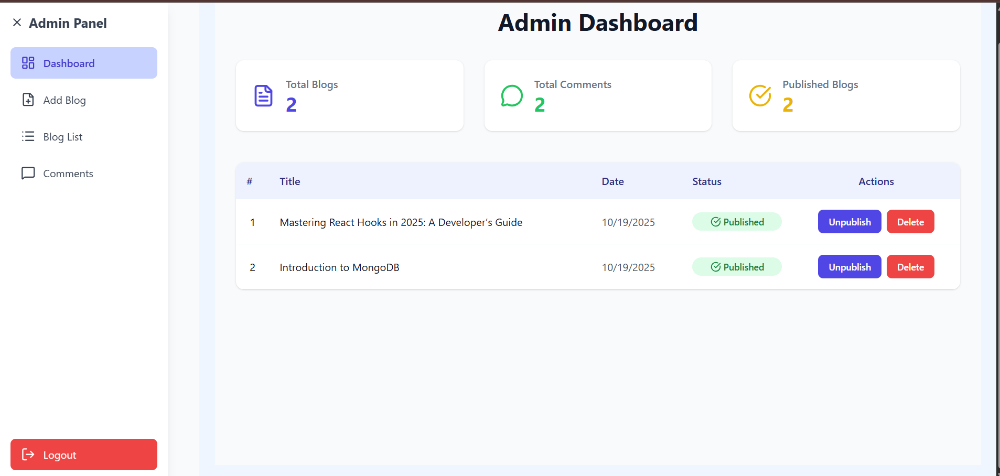
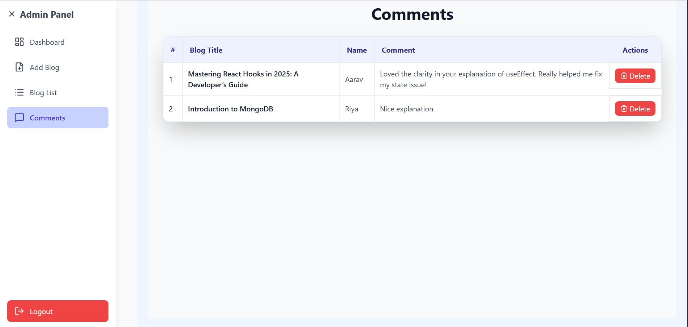

# 📝 BlogHub

<p align="center">
  
  
  
  
  
</p>

**BlogHub** is a modern and minimal blogging platform built with the **MERN stack**, allowing users to explore, read, and comment on blogs.  
It features a clean, elegant, and professional user interface focused on readability — perfect for showcasing technical or creative writing.

---

## 🚀 Features

- 📰 **Modern UI:** Clean, professional, and responsive design  
- ✍️ **Blog Management:** Add, view, and explore blogs easily  
- 💬 **Comment System:** Engage with posts via comments  
- 🔍 **Search Functionality:** Quickly find blogs by title  
- 🔒 **Authentication:** Secure login system using JWT  
- ⚡ **Dynamic Frontend:** Built with React + TailwindCSS for speed and beauty  

---

## 🧰 Tech Stack

| Layer | Technology Used |
|-------|------------------|
| Frontend | React.js, TailwindCSS, Axios, Lucide-React |
| Backend | Node.js, Express.js |
| Database | MongoDB |
| Authentication | JWT (JSON Web Tokens) |
| Styling | TailwindCSS |
| API Calls | Axios |

---

## 📁 Project Structure


mern-blog/
│
├── client/ 
│ ├── src/
│ ├── public/
│ └── package.json
│
├── server/ 
│ ├── routes/
│ ├── models/
│ ├── uploads/ 
│ ├── .env
│ └── server.js
│
├── .gitignore
└── README.md


---

## ⚙️ Setup & Installation

### 1️⃣ Clone the repository
```bash
git clone https://github.com/Spandana-MJ/bloghub.git
cd mern-blog

2️⃣ Backend Setup
cd server
npm install


Create a .env file inside server/:
PORT=5000
MONGO_URI=<your_mongodb_connection_string>
JWT_SECRET=<your_secret_key>

Run backend:
npm start
# or if nodemon installed
npm run dev

3️⃣ Frontend Setup
cd ../client
npm install
npm run dev

Create a .env file inside client/:
VITE_API_URL=http://localhost:5000

```

📸 Screenshots







---


👩‍💻 Author

Spandana M J
🌸 Passionate about full-stack web development and creating beautiful, user-centric applications.

<p align="left">
  <a href="https://www.linkedin.com/in/spandana-mj/" target="_blank">
    
  </a>
  &nbsp;
  <a href="https://github.com/Spandana-MJ/" target="_blank">
    
  </a>
</p>
